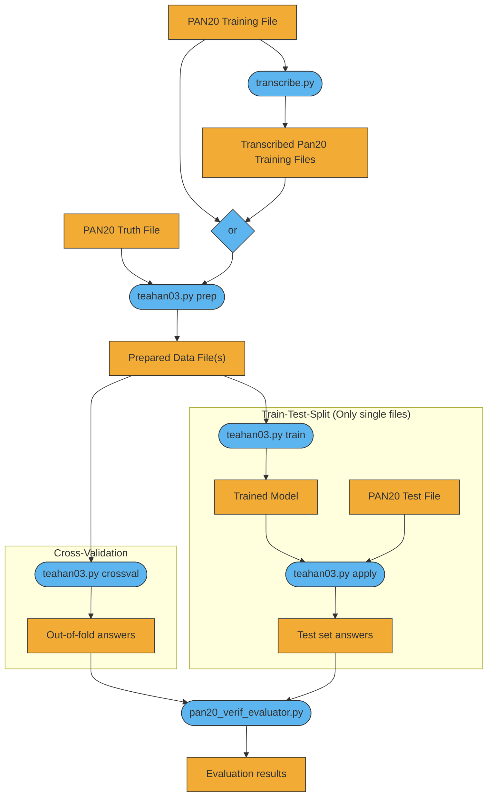

# teahan03-phonetic
Authorship Verification algorithm based on Teahan and Harper [2003] extended to use phonetic transcriptions.

## Example commands
```
pipenv install

pipenv run python teahan03.py prep -i data/raw/pan20-authorship-verification-training-small.jsonl -w data/raw/pan20-authorship-verification-training-small-truth.jsonl -o small_prepared.txt

pipenv run python teahan03.py train -i data/prepared/small_prepared.txt -o small_model.joblib

pipenv run python teahan03.py apply -i data/raw/pan20-authorship-verification-training-small.jsonl -o data/ -m data/model/small_model.joblib

python3 pan20_verif_evaluator.py -i data/raw/pan20-authorship-verification-training-tiny-truth.jsonl -a data/answers.jsonl -o data/

```

## Flow Chart
[![A rendered picture of the first diagram described below.](https://mermaid.ink/img/eyJjb2RlIjoiZ3JhcGggVERcbiAgICBkYXRhMVtQQU4yMCBUcmFpbmluZyBGaWxlXSAtLT4gb3JcbiAgICBkYXRhMSAtLT4gcHJvYzBcbiAgICBwcm9jMChbdHJhbnNjcmliZS5weV0pIC0tPiBkYXRhMFxuICAgIGRhdGEwW1RyYW5zY3JpYmVkIFBhbjIwIFRyYWluaW5nIEZpbGVzXSAtLT4gb3JcbiAgICBkYXRhMltQQU4yMCBUcnV0aCBGaWxlXSAtLT4gcHJvYzFcbiAgICBvcntvcn0gLS0-IHByb2MxXG4gICAgcHJvYzEoW3RlYWhhbjAzLnB5IHByZXBdKSAtLT4gZGF0YTNcbiAgICBkYXRhM1tcIlByZXBhcmVkIERhdGEgRmlsZShzKVwiXSAtLT4gcHJvYzJcbiAgICBzdWJncmFwaCBcIlRyYWluLVRlc3QtU3BsaXQgKE9ubHkgc2luZ2xlIGZpbGVzKVwiXG4gICAgcHJvYzIoW3RlYWhhbjAzLnB5IHRyYWluXSkgLS0-IGRhdGE0XG4gICAgZGF0YTRbVHJhaW5lZCBNb2RlbF0gLS0-IHByb2MzXG4gICAgZGF0YTVbUEFOMjAgVGVzdCBGaWxlXSAtLT4gcHJvYzNcbiAgICBwcm9jMyhbdGVhaGFuMDMucHkgYXBwbHldKSAtLT4gZGF0YTZcbiAgICBlbmRcbiAgICBkYXRhNltUZXN0IHNldCBhbnN3ZXJzXVxuICAgIGRhdGEzIC0tPiBwcm9jNFxuICAgIHN1YmdyYXBoIENyb3NzLVZhbGlkYXRpb25cbiAgICBwcm9jNChbdGVhaGFuMDMucHkgY3Jvc3N2YWxdKSAtLT4gZGF0YTdcbiAgICBlbmRcbiAgICBkYXRhN1tPdXQtb2YtZm9sZCBhbnN3ZXJzXSAtLT4gcHJvYzVcbiAgICBwcm9jNShbcGFuMjBfdmVyaWZfZXZhbHVhdG9yLnB5XSkgLS0-IGRhdGE4XG4gICAgZGF0YTYgLS0-IHByb2M1XG4gICAgZGF0YThbRXZhbHVhdGlvbiByZXN1bHRzXVxuXG4gICAgY2xhc3NEZWYgZGF0YSBmaWxsOiNmMmFjMzUsc3Ryb2tlOiMzMzM7XG4gICAgY2xhc3MgZGF0YTAsZGF0YTEsZGF0YTIsZGF0YTMsZGF0YTQsZGF0YTUsZGF0YTYsZGF0YTcsZGF0YTggZGF0YTtcbiAgICBjbGFzc0RlZiBwcm9jZXNzIGZpbGw6IzVkYjVlZixzdHJva2U6IzMzMztcbiAgICBjbGFzcyBvcixwcm9jMCxwcm9jMSxwcm9jMixwcm9jMyxwcm9jNCxwcm9jNSBwcm9jZXNzOyIsIm1lcm1haWQiOnt9LCJ1cGRhdGVFZGl0b3IiOmZhbHNlfQ)](https://mermaid-js.github.io/mermaid-live-editor/#/edit/eyJjb2RlIjoiZ3JhcGggVERcbiAgICBkYXRhMVtQQU4yMCBUcmFpbmluZyBGaWxlXSAtLT4gb3JcbiAgICBkYXRhMSAtLT4gcHJvYzBcbiAgICBwcm9jMChbdHJhbnNjcmliZS5weV0pIC0tPiBkYXRhMFxuICAgIGRhdGEwW1RyYW5zY3JpYmVkIFBhbjIwIFRyYWluaW5nIEZpbGVzXSAtLT4gb3JcbiAgICBkYXRhMltQQU4yMCBUcnV0aCBGaWxlXSAtLT4gcHJvYzFcbiAgICBvcntvcn0gLS0-IHByb2MxXG4gICAgcHJvYzEoW3RlYWhhbjAzLnB5IHByZXBdKSAtLT4gZGF0YTNcbiAgICBkYXRhM1tcIlByZXBhcmVkIERhdGEgRmlsZShzKVwiXSAtLT4gcHJvYzJcbiAgICBzdWJncmFwaCBcIlRyYWluLVRlc3QtU3BsaXQgKE9ubHkgc2luZ2xlIGZpbGVzKVwiXG4gICAgcHJvYzIoW3RlYWhhbjAzLnB5IHRyYWluXSkgLS0-IGRhdGE0XG4gICAgZGF0YTRbVHJhaW5lZCBNb2RlbF0gLS0-IHByb2MzXG4gICAgZGF0YTVbUEFOMjAgVGVzdCBGaWxlXSAtLT4gcHJvYzNcbiAgICBwcm9jMyhbdGVhaGFuMDMucHkgYXBwbHldKSAtLT4gZGF0YTZcbiAgICBlbmRcbiAgICBkYXRhNltUZXN0IHNldCBhbnN3ZXJzXVxuICAgIGRhdGEzIC0tPiBwcm9jNFxuICAgIHN1YmdyYXBoIENyb3NzLVZhbGlkYXRpb25cbiAgICBwcm9jNChbdGVhaGFuMDMucHkgY3Jvc3N2YWxdKSAtLT4gZGF0YTdcbiAgICBlbmRcbiAgICBkYXRhN1tPdXQtb2YtZm9sZCBhbnN3ZXJzXSAtLT4gcHJvYzVcbiAgICBwcm9jNShbcGFuMjBfdmVyaWZfZXZhbHVhdG9yLnB5XSkgLS0-IGRhdGE4XG4gICAgZGF0YTYgLS0-IHByb2M1XG4gICAgZGF0YThbRXZhbHVhdGlvbiByZXN1bHRzXVxuXG4gICAgY2xhc3NEZWYgZGF0YSBmaWxsOiNmMmFjMzUsc3Ryb2tlOiMzMzM7XG4gICAgY2xhc3MgZGF0YTAsZGF0YTEsZGF0YTIsZGF0YTMsZGF0YTQsZGF0YTUsZGF0YTYsZGF0YTcsZGF0YTggZGF0YTtcbiAgICBjbGFzc0RlZiBwcm9jZXNzIGZpbGw6IzVkYjVlZixzdHJva2U6IzMzMztcbiAgICBjbGFzcyBvcixwcm9jMCxwcm9jMSxwcm9jMixwcm9jMyxwcm9jNCxwcm9jNSBwcm9jZXNzOyIsIm1lcm1haWQiOnt9LCJ1cGRhdGVFZGl0b3IiOmZhbHNlfQ)

