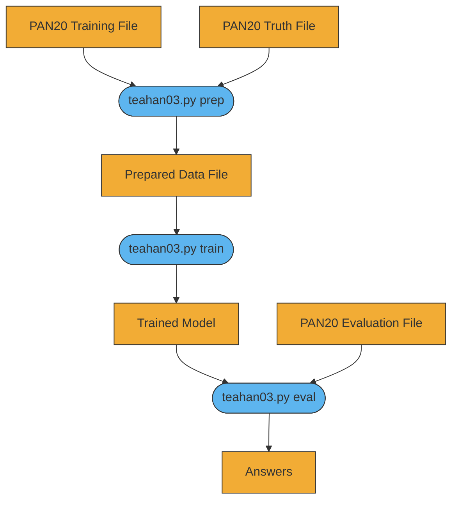

# teahan03-phonetic
Authorship Verification algorithm based on Teahan and Harper [2003] extended to use phonetic transcriptions.

[](https://mermaid-js.github.io/mermaid-live-editor/#/edit/eyJjb2RlIjoiZ3JhcGggVERcbiAgICBkYXRhMVtQQU4yMCBUcmFpbmluZyBGaWxlXSAtLT4gcHJvYzFcbiAgICBkYXRhMltQQU4yMCBUcnV0aCBGaWxlXSAtLT4gcHJvYzFcbiAgICBwcm9jMShbdGVhaGFuMDMucHkgcHJlcF0pIC0tPiBkYXRhM1xuICAgIGRhdGEzW1ByZXBhcmVkIERhdGEgRmlsZV0gLS0-IHByb2MyXG4gICAgcHJvYzIoW3RlYWhhbjAzLnB5IHRyYWluXSkgLS0-IGRhdGE0XG4gICAgZGF0YTRbVHJhaW5lZCBNb2RlbF0gLS0-IHByb2MzXG4gICAgZGF0YTVbUEFOMjAgRXZhbHVhdGlvbiBGaWxlXSAtLT4gcHJvYzNcbiAgICBwcm9jMyhbdGVhaGFuMDMucHkgYXBwbHldKSAtLT4gZGF0YTZcbiAgICBkYXRhNltBbnN3ZXJzXVxuXG5cbiAgICBjbGFzc0RlZiBkYXRhIGZpbGw6I2YyYWMzNSxzdHJva2U6IzMzMztcbiAgICBjbGFzcyBkYXRhMSxkYXRhMixkYXRhMyxkYXRhNCxkYXRhNSxkYXRhNiBkYXRhO1xuICAgIGNsYXNzRGVmIHByb2Nlc3MgZmlsbDojNWRiNWVmLHN0cm9rZTojMzMzO1xuICAgIGNsYXNzIHByb2MxLHByb2MyLHByb2MzIHByb2Nlc3M7IiwibWVybWFpZCI6e30sInVwZGF0ZUVkaXRvciI6ZmFsc2V9)

